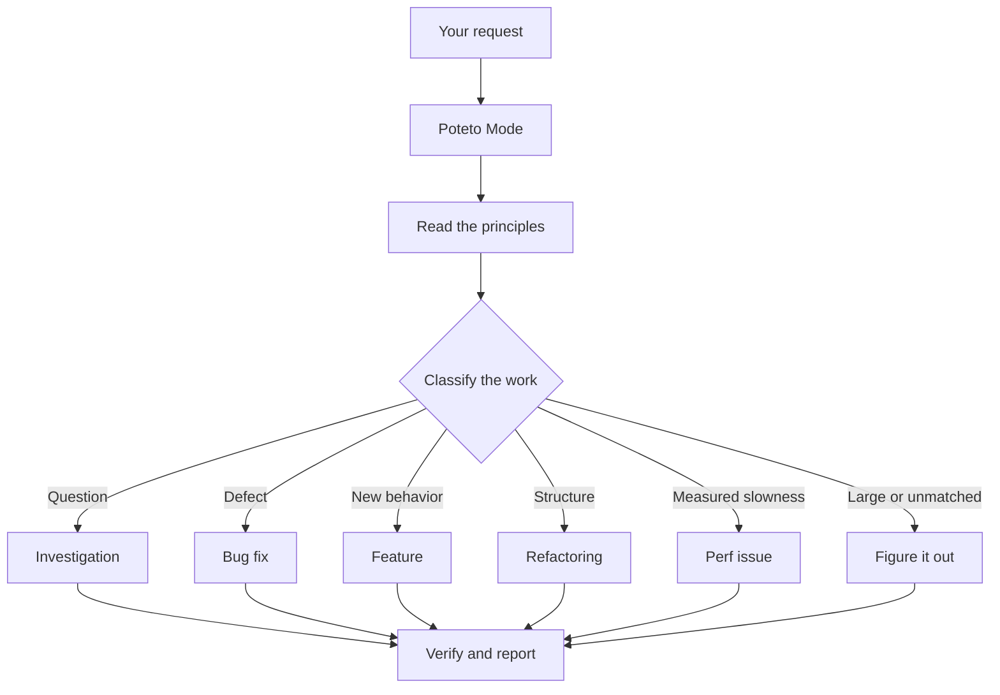

# Route work through Poteto Mode

`$supastack:poteto-mode` is the main entry point. Give it an outcome, constraints, and proof. It chooses one of 22 workflows and calls focused skills when their steps fire.



## State the goal and the proof

A useful prompt names the observed problem or desired result. Add anything that must stay unchanged and the evidence you want back:

```text
$supastack:poteto-mode users receive two notifications after a retry. Reproduce it first, fix the cause, and show one delivery after the same retry.
```

The router supplies the method. Avoid prescribing a chain such as “use how, then architect, then arena.” That chain can reorder or omit a required playbook step. Invoke one focused skill when you want to override the router for a specific purpose.

Start a new subject with a clear boundary:

```text
$supastack:poteto-mode new task. Find why the cache entry survives logout. Do not change code.
```

The last sentence pins the task to Investigation. Without it, a request in a build conversation may look like another build step.

## The 22 routable playbooks

| Work | Playbooks |
| --- | --- |
| Understand and diagnose | Investigation, Bug fix, Perf issue, Hillclimb, Runtime forensics, Trace forensics |
| Build and compare | Feature, Refactoring, Prototype, Visual parity |
| Improve workflows | Authoring a skill, Eval |
| Deliver code | Babysit, Shipping |
| Run extended work | Autonomous run, Orchestrate, Autopilot-full, Autopilot-stack |
| Preserve state and structure | Session pickup, Pause safely, Multi-phase plan, Worktree cleanup |

The package also contains `opening-a-pr.md`. Other playbooks invoke that delivery helper when you requested a PR or gave an authorized workflow permission to create one. Poteto Mode does not select it as a standalone route.

The [Poteto Mode skill](../../skills/poteto-mode/SKILL.md) holds the full matching rules. Each playbook lives under its [playbook directory](../../skills/poteto-mode/playbooks/).

## Isolate concurrent writers

Native Codex subagents share the parent's filesystem. Give concurrent code writers separate worktrees and branches. Assign one owner to each file set, and make each owner report the commands and evidence it produced.

Read-heavy work can share a checkout when no agent writes. `$supastack:swarm` and `$supastack:arena` define their own isolation and aggregation rules.

## Keep authority explicit

Poteto Mode can investigate, edit, and verify within the active task's scope. It does not gain permission to push, open a PR, merge, deploy, message people, or modify external systems because a playbook mentions those actions. Request those outcomes in the prompt when you want them.

Long-running workflows also need an explicit persistent objective. [Run long work](./07-long-running.md) shows how to name the goal, authority, and stop condition.

Next: [Understand the code](./03-understand.md).
