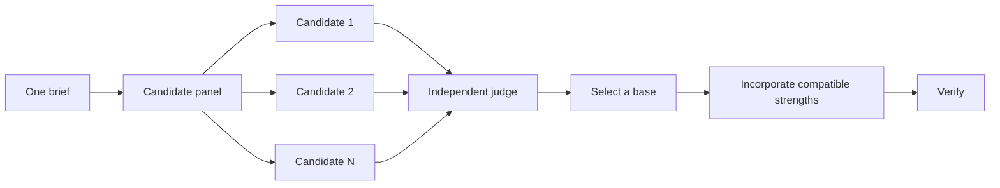

# Design before writing code

Use design fan-out when a change crosses boundaries, carries an expensive choice, or lacks a clear precedent. Supastack gives each kind of uncertainty a separate workflow.

## Settle interfaces with `architect`

```text
$supastack:architect design the import pipeline before implementation. Start from how callers should use it.
```

[`$supastack:architect`](../../skills/architect/SKILL.md) grounds the design in the current code, inspects history when ownership changes, and asks competing candidates to write usage, types, signatures, and a module map. It selects one coherent shape before implementation begins.

Request a checkpoint when you want to approve the shape first:

```text
$supastack:architect use a checkpoint. Show the selected design and stop before implementation.
```

## Compare candidates with `arena`

```text
$supastack:arena run four candidates on this cache-key design. Judge compatibility and migration cost.
```

[`$supastack:arena`](../../skills/arena/SKILL.md) gives each candidate the same brief in an isolated location. A separate judge scores the results against the stated rubric. The coordinator reads each candidate, picks a base, incorporates compatible strengths, and verifies the synthesis.



The role map in `${CODEX_HOME:-$HOME/.codex}/supastack/models.toml` controls the default panel when the current Codex interface supports model and reasoning-effort overrides.

## Cover independent slices with `swarm`

```text
$supastack:swarm check every package against its check script. Give one package to each worker and return one report.
```

[`$supastack:swarm`](../../skills/swarm/SKILL.md) partitions a coverage matrix, exploration set, gauntlet, or declared race. Each worker owns a bounded slice and reports `PASS`, `ISSUES`, or `BLOCKED`. The parent waits for all lanes and names any missing coverage.

Arena repeats one brief and produces a selected synthesis. Swarm divides the work or races declared alternatives under a selection rule. Choose based on the shape of the task.

## Challenge a finished design with `interrogate`

```text
$supastack:interrogate review the branch against its stated intent. Report behavioral bugs and regressions. Do not edit.
```

[`$supastack:interrogate`](../../skills/interrogate/SKILL.md) sends the intent and diff to independent reviewers. The lead sorts findings into `Act on`, `Consider`, `Noted`, and `Dismissed`, with evidence and dismissal reasons. It does not apply suggestions.

## Scale scrutiny to the decision

| Situation | Useful workflow |
| --- | --- |
| Small finished change with residual doubt | `interrogate` |
| Change crosses a function or ownership boundary | `architect` |
| One costly standalone choice | `arena` |
| Independent files, packages, scenarios, or race arms | `swarm` |
| Costly design with contested assumptions | `architect`, then `interrogate` |

Poteto Mode applies this ladder from its triggers. Invoke a design skill yourself when you want more scrutiny or a checkpoint that the default route would not add.

Next: [Build and clean](./05-build-and-clean.md).
