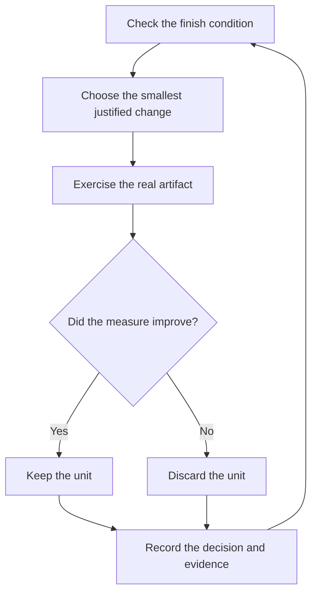

# Run long work

Long-running work needs a finish condition, an isolated workspace, defined authority, and a record you can audit. State each one before stepping away.

## Write the operating contract

```text
$supastack:poteto-mode treat this as a persistent goal. In a fresh worktree off <base>, migrate every caller to the new parser. Done means zero old callers, all parser fixtures pass, and no old API remains. Commit verified units as you go. Do not push or merge. Keep a decision log. If three distinct approaches hit the same external blocker, stop and document it.
```

This request supplies:

| Contract field | Value in the example |
| --- | --- |
| Outcome | Migrate every caller and delete the old API. |
| Verification | Search finds zero old callers and parser fixtures pass. |
| Isolation | A fresh worktree off the named base. |
| Authority | Local commits allowed; push and merge withheld. |
| Audit | A decision log records each accepted or rejected move. |
| Stop condition | Three distinct attempts confirm the same external blocker. |

Supastack calls `create_goal` only when you ask for a persistent objective. In an interactive Codex client, you can also start long work with `/goal`. The [official long-running work guide](https://learn.chatgpt.com/docs/long-running-work) recommends an outcome, constraints, and verification that the agent can check.

## Keep each iteration measurable



The goal stays fixed. A failed attempt can change the next hypothesis, but it cannot relax the completion test.

Use Codex goal status, event waiting, recurring monitoring, or an Automation when the active product exposes them. A plain sleep loop is a poor substitute because it loses context and cannot react to tool events.

## Preserve the decision trail

Invoke [`$supastack:show-me-your-work`](../../skills/show-me-your-work/SKILL.md) for work that another person will review later. The skill writes TSV rows with the phase, decision, reason, evidence pointer, and result. It sanitizes spreadsheet-leading characters and can stay local unless the review needs the trail in version control.

On return, ask for a review of decisions and gaps:

```text
$supastack:show-me-your-work summarize the overnight run. Lead with decisions that need my scrutiny and link each one to its evidence.
```

## Choose the right long-work shape

| Shape | Use it for |
| --- | --- |
| Autonomous run | One task driven to one checkable predicate. |
| `$supastack:figure-it-out` | A large task or one with no suitable bundled playbook; it designs an auditable custom run. |
| Autopilot-full | Independent PRs whose owners may merge after the root gives a clean verdict and your request grants merge authority. |
| Autopilot-stack | A coupled queue delivered as one verified stack for you to review and land. |
| Orchestrate | A multi-day program with many briefs and subagents under one coordinator. |

Autopilot-full needs an explicit merge grant:

```text
$supastack:poteto-mode run full autopilot on these independent items and merge each PR after its fresh verification verdict.
```

Autopilot-stack withholds that grant:

```text
$supastack:poteto-mode build and verify these changes as one stack. Do not merge; I will land it.
```

Use [Pause safely](../../skills/poteto-mode/playbooks/pause-safely.md) before a restart or planned interruption. Use [Session pickup](../../skills/poteto-mode/playbooks/session-pickup.md) to resume from the recorded branch, goal, decisions, and remaining checks.

Next: [Steer with principles](./08-principles.md).
